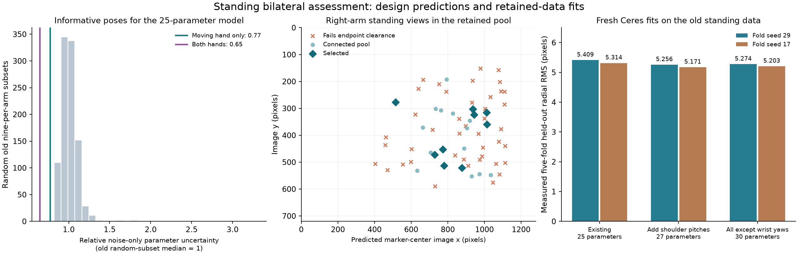

Assessment dated 2026-09-04, using the standing calibration setup. This follow-up replaces the preliminary pose-design conclusions in the [earlier review](calibration-review-2026-09-04.md).

Subsequent implementation: the [full 34-per-arm collection](full-bilateral-collection-2026-09-04.md) is now prepared and passed offline certification. It uses an expanded candidate pool and aligned clearance references; both CLI defects are fixed. The comparisons below concern the earlier retained nine-per-arm design, not this newly generated full route.

**The retained bilateral design is an informative compact experiment for its selected 25 parameters. Two concrete improvements are supported by further analysis: include the jointly identifiable shoulder-pitch terms in model comparison, and make candidate generation account for the clearance requirement used by the final route checker before discarding IK alternatives.** Neither a known torso fixture nor a renewed timing/flex investigation is required for these changes.

The analysis used the 41 left and 62 right standing observations, the retained August 27 nine-per-arm design, its source planning request and IK results, and the current collision geometry. It did not assume seated calibration or tabletop-reaching poses. The retained execution artifact predates the current reusable-core schema; the results below assess its pose geometry, not readiness of that old execution artifact for hardware use.

**1. The selected poses really are informative, beyond passing a rank gate.** I recomputed normalized projection Jacobians at one common physical model for all 103 old observations and 140 planned IK configurations. The selected-pose Jacobians reproduce the retained values exactly. Halving the finite-difference step changes entries by at most 5.7e-8. Old single-arm observations remain unpaired throughout.

To isolate pose quality from the extra marker in each new frame, I first counted only the moving hand in the new nine-left/nine-right design and compared it with 1,000 random nine-left/nine-right subsets of the old data:

| 25-parameter design; observation count stated per row | Scaled Jacobian condition | Relative predicted parameter uncertainty |
| --- | ---: | ---: |
| Old random subsets, median | 86.88 | 1.000 |
| New selected poses, moving hand only | 59.27 | 0.772 |
| New poses, both hands observed: 36 observations in 18 frames | 69.52 | 0.647 |

The moving-hand-only design beats all 1,000 sampled subsets on these two metrics. Thus its advantage is not solely the additional marker observation. Counting both hands further reduces predicted uncertainty, even though the condition number increases: condition number describes balance between directions, not total information.

These are **local, noise-only design predictions**, using equal independent 1 px noise per corner coordinate, fixed intrinsics, no priors, and the repository's parameter scales. Relative uncertainty is the square root of the mean diagonal of the normalized parameter covariance, divided by the old nine-per-arm median. It is not measured calibration accuracy and does not include the demonstrated model bias or correlated image errors.

The full old 103-observation dataset still contains more total information than the small new pilot. Repeated stationary-hand observations also do not replace distinct configurations: at an equal budget of 36 hand observations, the new paired design is broadly comparable to old 18-per-arm subsets. Seven additional paired anchors improve its aggregate predicted uncertainty by about 6%; their principal experimental purpose remains repeated-configuration consistency.



**2. The shared-camera model supports parameters that the old single-arm analyses could not identify.** This is the main correction to the previous interpretation of the parameter exclusions.

| Data/model arrangement | Data-only numerical rank |
| --- | ---: |
| One arm: camera 6 + target 6 + all joint offsets 7 | 17 / 19 |
| Both arms: shared camera 6 + targets 12 + all joint offsets 14 | 30 / 32 |
| Both arms, fixing the two terminal wrist-yaw offsets | 30 / 30 |
| Existing selected model plus both shoulder-pitch offsets | 27 / 27 |

These results hold on both the old combined data and the new planned observations. Each single-arm shoulder-pitch correction can be traded against that arm's camera estimate. With a shared camera and the different left/right shoulder axes in the URDF, those two ambiguities are resolved jointly. Each terminal wrist-yaw correction can still be traded against its own free hand-target transform.

This gain comes from fitting both chains with one camera. Under the static-camera assumption, the old unpaired datasets already contain that information; simultaneous capture is not required for this particular rank result. None of it independently proves the manufactured robot's geometry or the literal encoder zeros.

I then ran **36 fresh fits with the pinned Ferguson/Ceres optimizer**: three models, five folds plus a full fit, for two fold seeds. The 25-parameter baseline reproduces the old seed-29 result exactly.

| Model | Seed 29 overall RMS | Seed 17 overall RMS |
| --- | ---: | ---: |
| Existing selected 25 | 5.409 px | 5.314 px |
| Add both shoulder pitches: 27 | **5.256 px** | **5.171 px** |
| All offsets except terminal wrist yaws: 30 | 5.274 px | 5.203 px |

All training folds are observable. The 27-parameter improvement is modest and larger on the left. Its left/right RMS is 4.932/5.459 px for seed 29 and 4.710/5.454 px for seed 17. The remaining right-arm residual is still substantial. These are two partitions of the same old data, not independent later-day validation. The 30-parameter model does not beat 27 on either partition.

The 27-parameter model should therefore enter the declared comparison set, while 25 remains the deployed baseline. The fitted shoulder-pitch terms are effective corrections conditional on the fixed geometry, not independently measured physical offsets.

**3. Scoring the broader model changes which poses are useful.** The current nine-per-arm selection has condition number 69.52 for its 25 parameters, but 117.94 when both shoulder pitches are included. Re-running the current selector on the same certified connected pool with the 27-parameter Jacobian swaps just one right-arm candidate:

```text
remove right_candidate_0328
include right_candidate_0255
```

For the 27-parameter model, this changes the condition number from **117.94 to 90.47**, increases the weakest scaled singular value by about 30%, and lowers aggregate predicted parameter uncertainty by about 7%. That is a specific demonstration that the candidate set should be scored for the model we intend to compare. The alternate selected tour has not been motion-certified.

After eliminating camera and hand-mount nuisance parameters, the weakest joint direction in the original selected 25-parameter design is dominated by **right wrist pitch**. The weakest overall directions involve the free target transforms. Joint-angle correlation alone misses these distinctions; my earlier comparison of left-arm joint-matrix conditioning was insufficient to assess calibration information.

**4. The right-arm candidate shortage is mostly a clearance-policy issue, not a visibility problem or a missing preparation move.** The GPU replay reproduces the original connected pool and selected IDs exactly, with matching robot and mount geometry hashes.

| Candidate stage | Left | Right |
| --- | ---: | ---: |
| Camera-space target candidates submitted to IK | 490 | 494 |
| Retained successful IK poses, one solution per target | 73 | 67 |
| Excitations after removing the anchor and one marker-separation rejection per arm | 71 | 65 |
| Endpoints passing the route's clearance policy at the chosen opposite-arm anchor | 53 | 22 |
| Reached by the retained graph search | 35 | 22 |
| Selected pilot excitations | 9 | 9 |

The arms do move away from the torso before collection. In the retained preparation, right shoulder roll changes from **−7.49° in Ready to −12.07° at shoulder clearance**, then to **−19.15° at the visual anchor**. Later calibration candidates vary all seven arm joints. The initial preparation is not a constraint that keeps those later shoulder configurations unchanged.

Of the 43 right endpoint rejections, **37 are limited by `torso_link / right_shoulder_roll_link`**, a proximal arm link rather than the hand. These 37 poses have positive modeled gaps, approximately **0.004–4.981 mm**, below the required **5 mm** for that pair. IK's collision-free acceptance and optimizer activation band do not enforce the subsequent hard clearance requirement. The final checker correctly removes these poses before execution. These calculations do not establish physical contact on the robot.

I tested all 4,891 combinations of the retained left/right IK endpoints and the 49-left/10-right clearance-certified anchor sources. There are 409 endpoint-valid, sufficiently separated anchor pairs. None increases the right excitation count above 22. My earlier suggestion that simply choosing another existing anchor would fix the shortage is therefore unsupported by this pool. The left graph search also stops once it has enough candidates; its 35 connected poses are not proof that the other 18 endpoint-valid poses cannot be connected.

The IK stage requests four returned solutions but keeps only the successful solution closest to the clearance reference. A fresh, otherwise unchanged IK run reproduced 73/67 source views. Checking all returned solutions against the route clearance and visibility requirements raises usable distinct excitation views from **53 to 54 left** and **22 to 26 right**. Recovered right views are `0016`, `0228`, `0416`, and `0478`. This is useful but still below 34 distinct right target views. Multiple solutions for one target may also provide different arm configurations; they must be deduplicated and scored before counting them as useful excitation. Connectivity and tours for the recovered branches remain untested.

**The supported next changes are concrete.** Add the 27-parameter candidate to model comparison and evaluate pose information for it. In candidate generation, apply the same clearance policy used by the route checker while alternatives are still available, retain distinct useful IK branches, and generate additional views/configurations where the current pool is insufficient. Keep the existing clearance threshold. Recheck the resulting connected pool and selected tours, then create a current-schema offline execution artifact. The existing stale CLI argument must also be removed before the normal planner entry point can run.

The current information/joint/view weight tweaks are a low priority: on the existing connected pool, information-only selection changes aggregate 25-parameter uncertainty by only about 0.2%. The larger constraints arise before that scoring step. The available evidence supports retaining bilateral collection and improving these specific parts; it does not show that simultaneous capture alone will eliminate the roughly 5 px residual.

Local reproducibility artifacts are in [work/bilateral_plan_review_20260904](../work/bilateral_plan_review_20260904): [Jacobian analysis](../work/bilateral_plan_review_20260904/information_analysis.py), [numerical results](../work/bilateral_plan_review_20260904/standing_information.json), [graph replay](../work/bilateral_plan_review_20260904/standing_connectivity.json), [anchor sweep](../work/bilateral_plan_review_20260904/standing_anchor_sensitivity.json), [IK alternatives](../work/bilateral_plan_review_20260904/standing_ik_branches.json), and native fits for [seed 29](../work/bilateral_plan_review_20260904/jointly_identifiable_native_seed29.json) and [seed 17](../work/bilateral_plan_review_20260904/jointly_identifiable_native_seed17.json). These work artifacts depend on the retained local prototype data and are ignored by Git. No robot commands were issued; implementation and deployed calibration files were not modified by this assessment.
