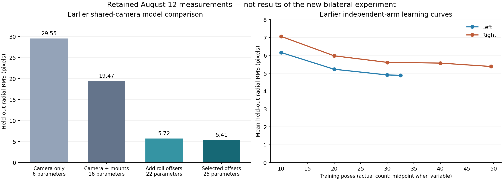

Review dated 2026-09-04. This is an assessment and proposed experiment; it does not change the calibration implementation or deployed bundle.

Follow-up: the [standing design assessment](bilateral-standing-design-assessment-2026-09-04.md) now contains the actual projection-Jacobian comparison, fresh native fits, anchor sweep, and IK-branch checks. It supersedes the preliminary joint-coordinate and anchor-selection suggestions below: the selected 25-parameter design is informative, both shoulder pitches are jointly identifiable under the shared-camera model, and another retained anchor does not increase the right-hand pool beyond 22 usable endpoints. The expanded 27-parameter model merits comparison.

The calibration setup is **standing G1 in Ready/FSM 4**, with the head camera and two Dex3 dorsal markers. The standing arm-SDK workflow and the later seated tabletop workflow are separate, as documented in the [README](../README.md). The earlier [implementation plan](../../robot-calibration-aprilcube-prototype/docs/detailed_implementation_plan.md) explicitly keeps the robot standing and excludes waist and legs from the calibration solve. Pose selection here concerns identifiable arm/camera geometry across feasible standing configurations and visible target views. It must not be restricted to tabletop-reaching poses.

**I would retain the bilateral collection machinery, focus on the remaining kinematic-model error and pose coverage, and remove the requirement for a known torso-mounted reference.** The proposed collection addresses important weaknesses in the earlier experiment. It has not yet demonstrated that it resolves the remaining configuration-dependent error, and it cannot independently establish a physical torso frame merely by observing another unknown marker.

Correction after checking the earlier automatic-run analysis: my initial version made another mechanics/timing experiment the first gate. That repeated work already supported by the retained evidence. `auto_run_004` reproduced the shoulder-roll discrepancy with human contact removed; the later Dex3 analysis rejected timing as a material explanation and did not support gravity/load as the leading residual cause. Repeated anchors remain useful for the unresolved temporal question, but a separate timing/flex investigation is not a prerequisite without new contradictory evidence.

The reference-fixture suggestion had an unresolved prerequisite. I was implicitly assuming an independent survey of the marker and physical datums defining `torso_link`. Neither that survey nor an accessible, validated datum scheme has been established on this robot. A coordinate-measuring system would only help once those datums were identified; measuring the fixture alone would not suffice.

The earlier [torso fixture analysis](../../robot-calibration-aprilcube-prototype/docs/torso_charuco_fixture_analysis.md) recovered a nominal M6-pattern transform from the manufacturer drawing, URDF, and shell STL. Hardware inspection confirmed useful relative dimensions, but the document explicitly distinguishes these from unmeasured axial seating and manufacturing tolerances. Printing the bracket in those coordinates gives a nominal transform. Repeated installation can establish repeatability without establishing absolute accuracy.

Let `X = torso_T_camera`, `H = torso_T_marker`, and `M = camera_T_marker`. A stationary image provides:

```text
M = inverse(X) @ H
```

For any rigid transform `G`, replacing `X` by `G @ X` and `H` by `G @ H` leaves that measurement unchanged. More images of the same fixed arrangement cannot separate the two unknowns. Using the arm calibration to estimate `H` and then calling `H` an independent reference for that same arm calibration would be circular.

An optional rigid torso marker with known internal geometry can still measure relative camera motion without a surveyed torso pose. If its torso pose stays constant, then `camera_0_T_camera_i = M_0 @ inverse(M_i)`. This is conditional on marker rigidity and pose-estimation quality. Its absolute registration remains unknown. A table-mounted marker measures camera-to-table motion instead; that motion can include waist/body movement and does not establish camera-mount motion relative to the torso. Neither accessory is a prerequisite for the plan below, and no feasible new torso-marker mounting arrangement is assumed.

**What the retained measurements establish.** I loaded and validated the 62 right and 41 left solver samples, checked the accepted raw image hashes, and re-ran marker detection on 735 accepted frames. None contained detections of both hand markers. I also independently reprojected every held-out sample using the stored five-fold shared-model fits, measured joints, and matching URDF. The overall RMS reproduced as 5.4091303833 px; per-capture differences from the saved results were below 3e-13 px. This verifies the stored-fit evaluation, rather than constituting a fresh optimizer run. Both source sessions remain unfinalized.

The common-camera model comparisons in the [retained study](../../robot-calibration-aprilcube-prototype/work/dex3_hypotheses_20260812/dual_shared_camera_5fold.json) are:

| Earlier model | Parameters | Held-out radial RMS |
| --- | ---: | ---: |
| Shared camera, fixed CAD hand targets, no joint offsets | 6 | 29.55 px |
| Shared camera, two fitted hand targets, no joint offsets | 18 | 19.47 px |
| Shared camera, fitted targets, shoulder/wrist roll offsets on both arms | 22 | 5.72 px |
| Shared camera, fitted targets, selected offsets | 25 | 5.41 px |

The last model gives 5.16 px left and 5.57 px right. Its fitted camera varies across folds by at most 1.19 mm and 0.26 degrees. That is useful conditional stability, not independent metrological accuracy. The new selected model has the same 25-parameter structure: camera 6, two hand mounts 12, and seven selected joint offsets. Its principal advance is the experiment and production workflow.



The earlier [diagnostic study](../../robot-calibration-aprilcube-prototype/docs/dex3_dual_arm_hypothesis_analysis.md) gives several reasons to investigate the remaining error before collecting a much larger set:

- Median marker-only PnP residual was approximately 0.22 px on each arm, much smaller than the kinematic reprojection residual. This makes ordinary corner noise an insufficient explanation; low planar PnP residual does not itself certify accurate 3D pose.
- For independently fitted arm models, right-arm held-out RMS fell from 5.44 to 3.74 px with a joint-position residual predictor trained inside each fold. That explains 52.8% of held-out squared residual. The quadratic **joint-and-torque** model reached 3.38 px. These are diagnostic predictors, not validated replacement calibrations, and they do not uniquely identify compliance, axis geometry, or camera movement as the cause.
- Chronological validation was worse than random folds: 7.51 versus 5.44 px on the right, and 5.66 versus 5.06 px on the left. Time and pose order were confounded, so this is a reason for a controlled repeat experiment rather than proof of time drift.
- Learning curves flattened substantially after roughly 30–40 poses. More samples from the same distribution have limited demonstrated benefit.
- The Dex3 timing hypothesis was explicitly rejected as a material explanation: median pairing deltas were 0.832 ms right and 0.737 ms left, and pairing metrics had no corrected association with held-out error. The older manual analysis propagated measured velocities through pairing deltas and obtained only 0.0072 px RMS. Its known lagged capture did not explain the stable fitted correction. Retain existing acquisition safeguards; these results do not justify restarting timing diagnosis.

The [automatic hands-off run](../../robot-calibration-aprilcube-prototype/work/auto_run_004_latest/deep_analysis.md) is additional evidence that should have informed the original recommendation. Across 50 accepted poses it retained a shoulder-roll-equivalent correction of +3.378 +/- 0.045 degrees across folds, compared with +3.798 +/- 0.197 degrees in the earlier manual dataset. Removing human support did not remove the main signal. These runs used the earlier hand/cube setup, so they establish that result for that setup rather than proving every mechanical component in the later Dex3 setup rigid.

The later Dex3 study found that adding estimated torque to a joint-position residual predictor worsened right-arm RMS from 3.736 to 4.289 px. It explicitly rejects gravity/load as the leading residual explanation. It leaves structural compliance among possible mechanisms, but does not demonstrate it. The practical priority is configuration-dependent kinematic/model discrepancy; operator support, timing, and speculative flex should not be promoted back to leading causes.

**What the new proposal fixes, and what remains.** Simultaneous left/right observations remove the earlier separation in acquisition time and provide a useful common observation when one arm is held still. Repeated anchors can expose temporal inconsistency. Full-model information scoring, data-only rank checks, immutable replay, and shared-model export all address real limitations. Fitting the two hand mounts avoids treating nominal mounting geometry as exact.

Those changes do not introduce an independent torso reference or a richer physical error model. An anchor reconstructed through the arm kinematics is a consistency check. If both camera mounting and arm geometry are allowed to vary freely, the images do not automatically identify which changed. Constant offset estimates should therefore be described as effective corrections under stated fixed geometry and gauge choices; physical encoder-zero claims require stronger evidence.

The retained August 27 GPU graph smoke selected nine excitation poses per arm and achieved model rank 25/25 with normalized condition number 69.5. It demonstrated numerical design and motion-planning feasibility for that artifact, not measured calibration accuracy. Its anchor-connected pool contained 35 left and 22 right candidates, so that particular component could not supply the default 34 right excitation poses.

A comparison using identically standardized joint coordinates also shows that improvement was uneven. Among 1,000 random nine-pose subsets of the old data, the new right design had a condition number better than approximately 93.5% of subsets; the new left design was worse than approximately 78.9%. This is a sampling diagnostic, not a substitute for projection-Jacobian observability. It supports assessing several anchors and workspace coverage rather than assuming one feasible anchor gives uniformly strong excitation. The old study's differently scaled Jacobian condition number should not be directly compared with the new one.

The current validation defaults allow 8 px RMS and do not require multiple days. Passing those thresholds cannot demonstrate improvement over the deployed bundle. Both bundles must be scored on the same untouched new observations. The useful 22-parameter model is also absent from the declared candidate hierarchy and should be included for comparison.

There is a separate practical blocker in the inspected checkout: `run_plan_bilateral_calibration` reads `args.maximum_route_reselections`, which the parser does not define. A dry entry-point probe reproduced the resulting `AttributeError` before input reading, planning, or output creation. The retained execution artifact also uses an older schema rejected by the current version-5 loader. These findings require a CLI correction and a fresh offline artifact before treating the current path as runnable. They do not invalidate the older calibration measurements.

**The plan I would run from scratch is the following.** The objective is to estimate the shared torso-to-camera transform, separate hand-marker transforms, and identifiable arm corrections from standing observations, then validate camera-to-arm predictions on unseen configurations. Physical parameter interpretation remains conditional on the fixed robot geometry and gauge choices. No independently known marker-to-torso transform is assumed.

1. **Carry forward the established standing measurement conditions.** Start from standing Ready/FSM 4 and use the existing arm-SDK acquisition/return lifecycle. Retain factory intrinsics, the measured device-specific camera frame chain, raw images, full state windows, and the existing image/state pairing and stationary-capture safeguards. Preserve the verified target geometry and side-specific frame conventions. Use automatic hands-off capture with a consistent finger posture, support, waist posture, and payload. Waist and leg parameters are outside this solve; the full measured state still belongs in the evidence. Short bursts estimate image variability; they do not count as independent robot poses. Reopen a timing or mounting investigation only if new evidence violates these conditions.

2. **Use the retained residuals to define the model and pose-design questions.** Start from the demonstrated static-offset benefit and remaining joint-dependent residual. Compare the 22- and 25-parameter baselines, inspect joint correlations and poorly covered configurations, and identify paired poses that distinguish candidate joint effects. Profile only limited, identifiable geometric extensions supported by those patterns, using grouped held-out error to decide whether they help. A fitted correction remains an effective model term unless independent evidence establishes its physical source. This offline work should guide the new collection, rather than spending another run broadly testing timing or operator-induced flex.

3. **Collect informative standing calibration poses with repeated anchors built in.** Start with a budget of approximately 30–40 distinct configurations per arm, plus roughly 10–12 untouched standing validation configurations per arm. These are planning budgets, not guaranteed adequate counts. Use several feasible bilateral anchor configurations if one anchor restricts coverage, connecting them with separately certified paths. Repeat anchors through interleaved left/right blocks to address the remaining time-versus-pose ambiguity, evaluating residuals at the measured joints. This is an integrated consistency check, not an assumption that the camera is moving. Both markers remain visible at the calibration captures. Evaluate the connected candidate pool and information after standing-state collision filtering, including independent joint directions, target depths/orientations, and image coverage. Calibration poses may occupy any feasible observable part of the standing arm workspace; proximity to a tabletop is not a selection objective. Score a noise-weighted, parameter-scaled projection Jacobian and protect its weak directions. Assess prediction uncertainty across that calibration domain as well as parameter information. The distinction between parameter precision and endpoint prediction is discussed by [Sun and Hollerbach](https://cse.usf.edu/~yusun/lab_pub/icra0801.pdf).

4. **Fit a small declared model hierarchy and examine what it cannot explain.** Compare 18 parameters, 20 with shoulder rolls, 22 with shoulder/wrist rolls, and the previous selected 25. Keep the all-offset model as an observability diagnostic. Fit raw corner reprojections with one camera and two unknown rigid hand mounts. In transform form, the prediction is `camera_T_marker = inverse(torso_T_camera) @ torso_T_hand(q + offsets) @ hand_T_marker`; the absolute registration comes from the assumed robot geometry across many configurations. Inspect the data-only Jacobian and null directions before applying priors. More poses cannot remove a structural gauge. If stable residual structure persists, use the diagnostic pattern to propose one limited geometric or state-dependent extension and test it on separate data; do not free every geometric quantity at once.

5. **Require independent standing validation before deployment.** Split by configuration and acquisition block, keeping burst frames and repeated configurations together. Use an untouched later-day standing acquisition with repeated validation configurations and a different visit order; multiple days must be a release requirement. Compare the candidate and deployed bundle on identical raw observations, reporting each arm, anchors, errors by joint/view region, upper-tail errors, and grouped uncertainty. Model selection and any residual predictor tuning must stay within training data. Define the acceptance criteria before examining the final test set. An 8 px pass flag or bootstrap parameter stability alone is insufficient.

6. **Keep calibration validation distinct from later application validation.** Standing held-out corner predictions test the fitted camera/arm relationship. They do not establish an independently measured torso-frame ground truth or 3D fingertip accuracy. Later seated tabletop deployment can separately measure reaching/placement performance and account for torso-to-table motion. That downstream evaluation does not define the standing collection's pose region or require a tabletop reference during calibration.

The next priority is to design standing observations that better distinguish the remaining kinematic terms and test whether the resulting model generalizes across unseen standing arm configurations and target views. Existing timing and hands-off results justify proceeding on that basis. Repeated anchors can flag new inconsistency during collection without requiring us to presume a mechanical or timing fault, or pretend that an unknown fixture transform is known.

The local [analysis script](../work/bilateral_plan_review_20260904/analyze.py) and [evidence JSON](../work/bilateral_plan_review_20260904/evidence.json) retain the raw verification, stored-fit reprojection, model tables, and sampling comparison. They live in the ignored `work/` directory and depend on the local prototype evidence. The original temporary planning artifacts are identified in the evidence JSON; archived copies are retained beside the script. No robot commands or fresh geometric optimizer fits were run for this review.
